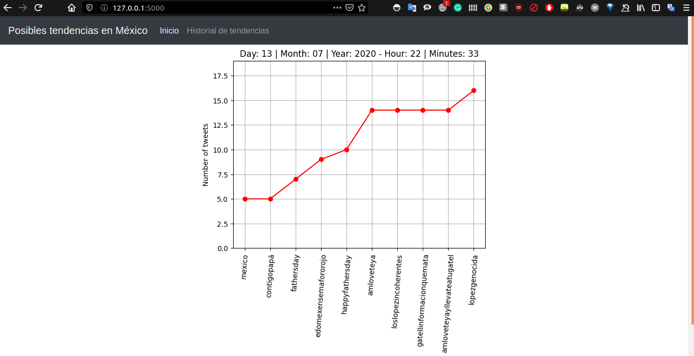
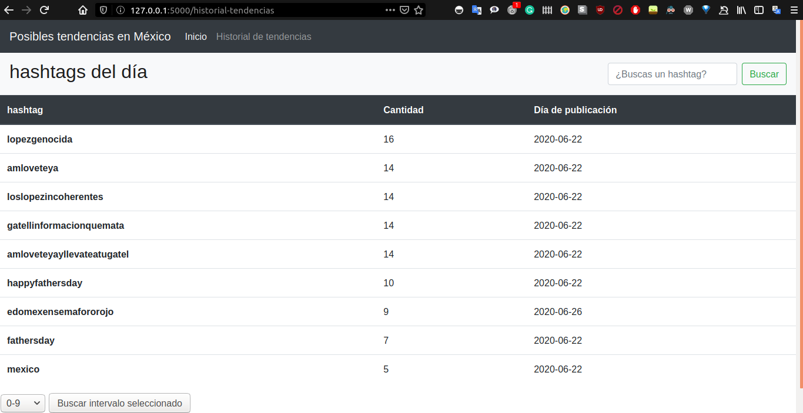
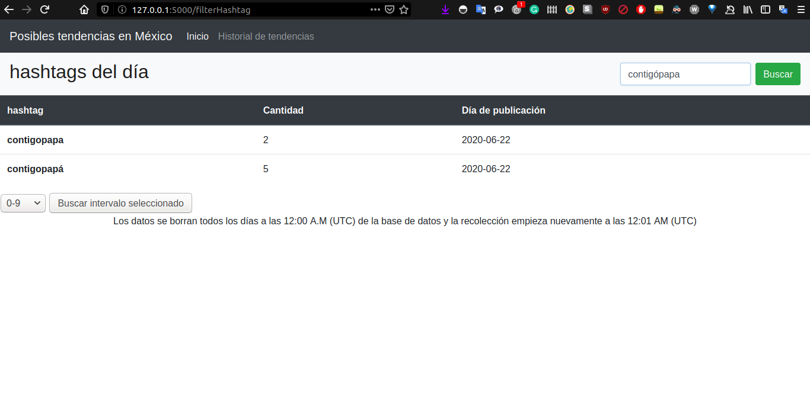
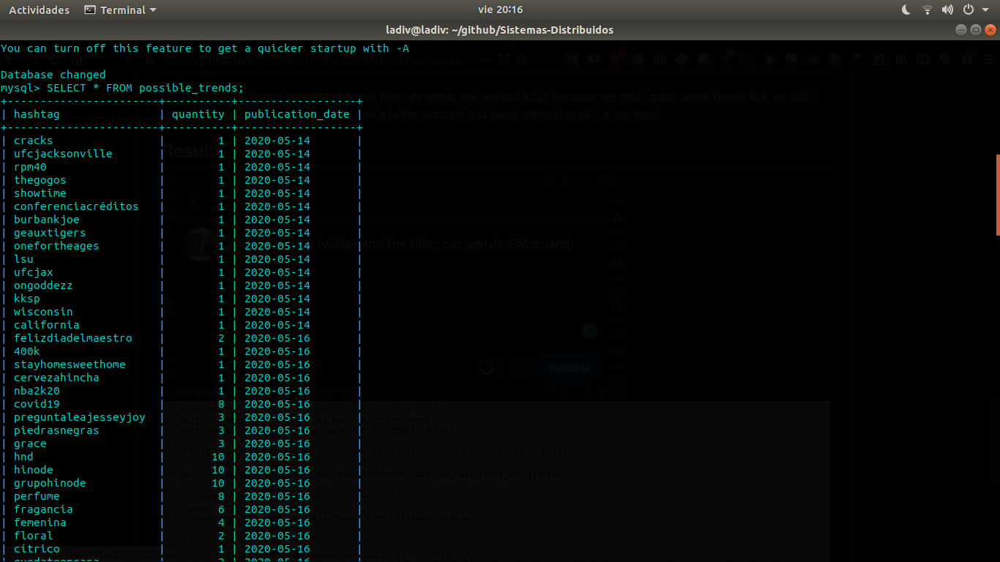
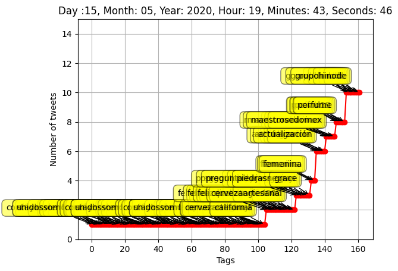

# Identifying possible trends on Twitter
- Monserrat Esperanza Alvaréz 
- José Vidal Cardona Rosas 

# Contact information
- esperanzaalvarez120@gmail.com 
- vrosas832@gmail.com

# Type of licence
GNU General Public License v3.0
    
# General objectives
* Identify possible trends Latin America
      
# Software Tools
* Twitter API
* mysql Library
* json Library
* datetime Library
* Matplotlib Library
* sys Library
* Flask Library

# Data Source
* Twitter

# General system architecture 
* Data source: Twitter
* Storage system: Mysql
* Processing system: Python, Tweepy, json and Mysql
* Data visualization: matplotlib.pyplot
* View Data: Python - Flask, HTML and CSS

# Install and use
## Some libraries that you need
* **Flask: web page**
> pip3 install Flask
* **Matplotlib: To generate the image**
> pip3 install  matplotlib
* **mysql: To store the data**
> pip3 install MySQLdb
* **Tweepy: To get the data from Twitter**
> pip3 install tweepy

## About our Data Base
Before, you need to install Server SQL in your machine
* > sudo apt install mysql-server

After the install and config, follow the steps for create the Data Base as follow:

* > CREATE DATA BASE trends;
* > USE trends;
* > CREATE TABLE possible_trends(hashtag VARCHAR (280), quantity INT, publication_date DATE);

**Now, you have the necessary libraries. Follow the next steps for use the project** 
* Clone or download this [project](https://github.com/Ladivcr/Sistemas-Distribuidos.git) 
> The project use some librarys, so, you need to install this librarys for optimal use. 
> You will need to use some credencial from API Twitter, If you have it you can put it your credencial in the code. 
> If you don't have credencial, I will send my credencial in an Email (Just if you are my teacher or his assistant) 
* Open a terminal 
* Write: ./00runTrends.sh 
> In this step, you should have already put your credentials in the code
* Press Enter
* After this, you start to get the data from Twitter automatically

**Note:** If you don't have credencials from Twitter, you will need to create a development account on [Twitter](https://developer.twitter.com/) :+1:

**Extra Note:** You need to change some paths in the code, because the paths are paths in my personal computer.
## to view the page

* Open a terminal 
* Write: python3 04index.py
* Press Enter
> After this comand, the terminal display the addres for the web page
* Copy the address
* Paste in a browser and...

# You can view something like: 

# Abstract
    Currently, we have the power of social media for communication in real time
    and the principal use is communication. 
    But we can give a second use all this tools on different fields like e-commerce, 
    political, sales, etc. Twitter is a network of networks and the people share 
    "Tuits" with things about their day a day with some data, data about food,
    drinks, clothes, feelings, opinions, etc. Sometimes used "hashtags" for describe
    the "Tuit". So we can do  Web scraping for get this different kinds data, 
    clean the data and processing the data and finally try to identify a trend.

# Methodology
Extreme programming 

# Implementation and tests
We ran our code for get some tweets with filter per geographical coordinates
and we had lucky because we could catch many tweets but, we wanted to try our others
codes (02 and 03) so, we stored this tweets and plot this tweets. 
## Results
## Storage tweets 

# Plot tweets

As we can see, there are many tweets because when we did the query, we didn't specify 
some range. 

# Conclusions
Our project is not over yet

# Bibliography
We can did it with some help.
* To get data: [documentation about tweepy](https://tweepy.readthedocs.io/en/v3.5.0/index.html#) 
* To visualize web page: [documentation about Flask](https://flask.palletsprojects.com/en/1.1.x/)
