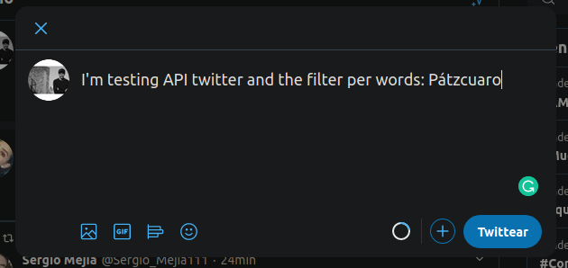
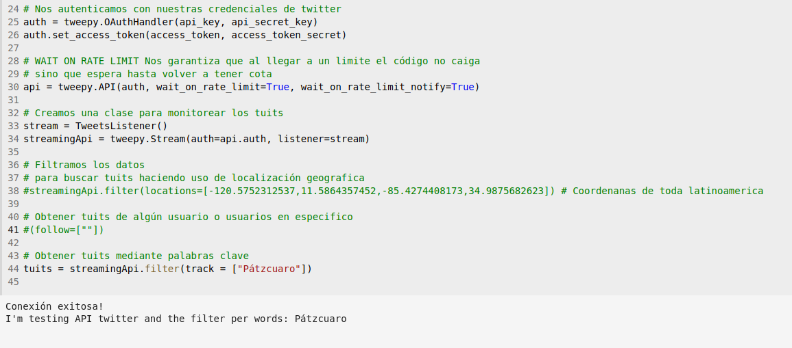

# Identifying possible trends on Twitter
- Monserrat Esperanza Alvaréz 
- José Vidal Cardona Rosas 

## Contact information
- esperanzaalvarez120@gmail.com 
- vrosas832@gmail.com

## Type of licence
GNU General Public License v3.0
    
## General objectives
* Identify possible trends Latin America
      
## Software Tools
* Twitter API
* Pandas Library
* Matplotlib Library
* Seaborn Library

## Data Source
* Twitter

## General architecture of the system
* Data source: Twitter
* Storage system: Mysql
* Processing system: Python and Tweepy
* Data visualization: HTML5, Pyplot and other different tools for data visualization

## Install and use
* Clone or download this [project](https://github.com/Ladivcr/Sistemas-Distribuidos.git) 
> You will need to use some credencial from API Twitter, If you have it you can put it your credencial in the code. 
> If you don't have credencial, I will send my credencial in an Email (Just if you are my teacher or his assistant) 
* Open a terminal 
* Write: python3 01mainTuit.py 
> In this step, you should have already put your credentials in the code
* Press Enter

**Note:** If you don't have credencials from Twitter, you will need to create a development account on [Twitter](https://developer.twitter.com/) :+1:

## Abstract
    Currently, we have the power of social media for communication in real time
    and the principal use is communication. 
    But we can give a second use all this tools on different fields like e-commerce, 
    political, sales, etc. Twitter is a network of networks and the people share 
    "Tuits" with things about their day a day with some data, data about food,
    drinks, clothes, feelings, opinions, etc. Sometimes used "hashtags" for describe
    the "Tuit". So we can do  Web scraping for get this different kinds data, 
    clean the data and processing the data and finally try to identify a trend.

## Methodology
Extreme programming 

## Implementation and tests
We ran our code for get some tweets with filter per words
and we had lucky because we could catch some tweets but, we didn't know
if this tweets were real, so, we used a twitter account and tweet something
with a key word.
## Results

As we can see, our code works and this check our tests

## Conclusions
Our project is not over yet

## Bibliography
We can did it with helped from [documentation](https://tweepy.readthedocs.io/en/v3.5.0/index.html#)
